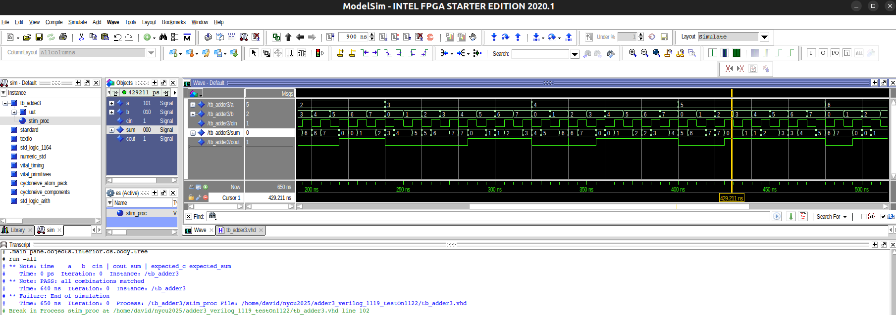

## Project 1: 3-bit ripple-carry adder (RCA)

##### Objectives: 
* To understand half adders, full adders, and **ripple-carry adder (RCA)**.
* To implement RCA and write a testbench on **ModelSim**.

---

* Altera DE2-115: [User Manual](https://www.terasic.com.tw/attachment/archive/502/DE2_115_User_manual.pdf).
* `Quartus Prime` Version: **24.1std.0 Lite Edition**.
* `ModelSim` Version: **Starter 2020.1**.

---

### How to run?

* Step 1. Find your Quartus license and export the file path:
```
export LM_LICENSE_FILE=/root/.altera.quartus/quartus2_lic.dat
```

* Step 2. Open the **Quartus Prime Lite** with
```
<path_to_dir>/intelFPGA_lite/24.1std/quartus/bin/quartus
```

* Step 3. Click `View` >> `Utility Windows` >> `Tcl Console`
* Step 4. Navigate to your Tcl Console and type
```
source main.tcl
```
* Step 5: Start Compilation (shortcut: `Ctrl + L`).
* Step 6: Start a simulation directly from the Quartus GUI by going to `Tools > Run Simulation > RTL Simulation`. ModelSim will automatically open, and your simulation signals will be presented.
* Step 7: Right click on the wave window and select `Zoom Full`.



---

* Note-1. You can re-do the simulation in QuestaSim (ModelSim) by executing
```
do ./vsim/wave.do
```
Where `wave.do` was generated by clicking `File` >> `Save Format`.

* Note-2. **ModelSim** can be executed independetly without Quartus Prime by opening
```
<path_to_dir>/intelFPGA/20.1/modelsim_ase/bin/vsim
```
