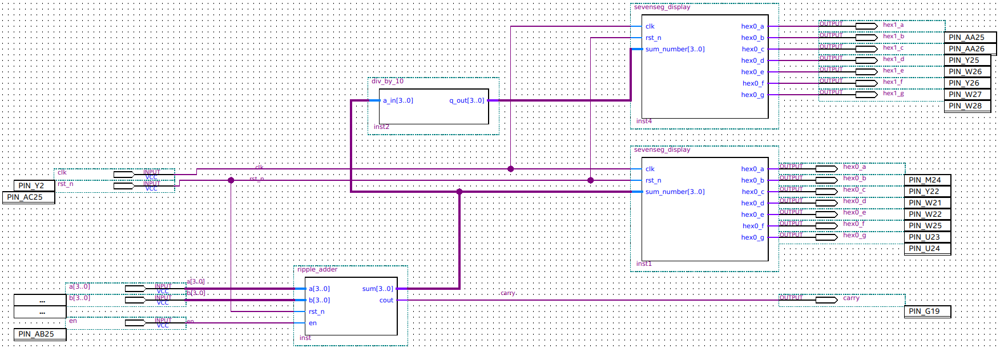
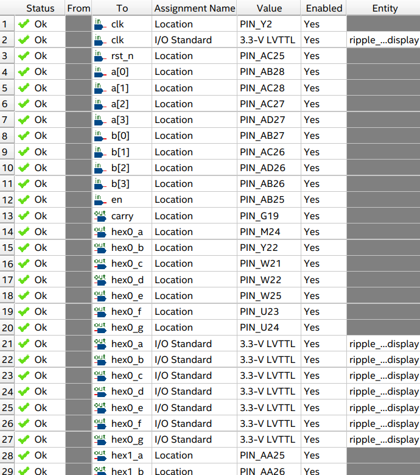
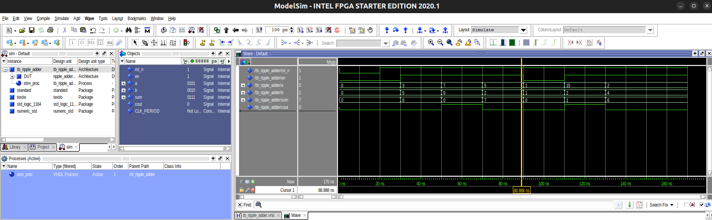

<p align="center">
<h1 align="center">
4-bit adder with enable and synchronous reset
</h1>
<h3 align="center">
<a href="https://github.com/twwang97/altera-de2-115/4bit-adder/blob/nycu2025/"><strong> Code </strong></a>
|
<a href="https://youtu.be/OLvouKIflv0"><strong> Video </strong></a>
|
<a href="./images/report.pdf"><strong> Report </strong></a>
</h3>

</p>

* Course: Digital Design with FPGA
* Semester: Fall 2025
* Student: Tsung-Wun (David) Wang
* Instructor: Sun-Ting Lin
* National Yang Ming Chiao Tung University

---

##### Objectives: 
* To understand half adders, full adders, 4-bit **ripple-carry adder (RCA)**, and **carry-lookahead adder (CLA)**.
* To implement **RCA** and **CLA** and write a testbench on **ModelSim**.
* To program the board `DE2-115` to compare the experimental results with simulation signals.

---

* The default algorihtm is **carry-lookahead adder (CLA)**. To change it to RCA, replace **cla_4bit** with **rca_4bit** in the VHDL wrapper file [ripple_adder.vhd](./ripple_adder.vhd#L87).
* Altera DE2-115: [User Manual](https://www.terasic.com.tw/attachment/archive/502/DE2_115_User_manual.pdf).
* `Quartus Prime` Version: **24.1std.0 Lite Edition**.
* `ModelSim` Version: **Starter 2020.1**.

##### Block Design and Pin Assignment:


---


---

### How to run?

* Step 1. Find your Quartus license and export the file path:
```
export LM_LICENSE_FILE=/root/.altera.quartus/quartus2_lic.dat
```

* Step 2. Open the **Quartus Prime Lite** with
```
<path_to_dir>/intelFPGA_lite/24.1std/quartus/bin/quartus
```

* Step 3. Click `View` >> `Utility Windows` >> `Tcl Console`
* Step 4. Navigate to your Tcl Console and type
```
source main.tcl
```
* Step 5: Start Compilation (shortcut: `Ctrl + L`).
* Step 6: Run simulation by clicking `Tools` >> `Run Simulation Tool` >> `RTL Simulation`. Then observe your simulation signals.
* Step 7: Right click on the wave window and select `Zoom Full`.



---

* Note-1. You can re-do the simulation in QuestaSim (ModelSim) by executing
```
do wave.do
```
Where `wave.do` was generated by clicking `File` >> `Save Format`.

* Note-2. **ModelSim** can be executed independetly without Quartus Prime by opening
```
<path_to_dir>/intelFPGA/20.1/modelsim_ase/bin/vsim
```
