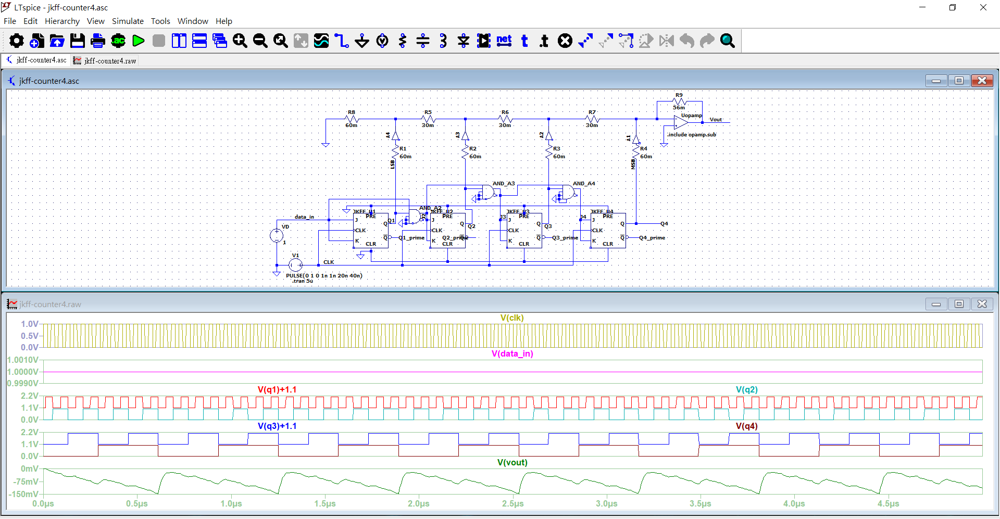

## Electronic Project: 4-bit Counter using JK Flip-Flops

##### Objectives: 
* To understand JK flip-flops and its CMOS configuration.
* To implement 4-bit counter with an R-2R digital-to-analog converter (DAC) in LTspice.

---

### Schematic

* LTspice `24.1.10` for `Win 10`.
* How to run? Just open the schematic file (`*.asc`).
* Note: You don't have to open the netlist file (`*.net`)
* This program includes some subcircuits defined in `0101.sub`; such models are forked from [Vlad's Website](http://ltspicegoodies.ltwiki.org/0101.php).
* The subcircuit  **JKflop** defined in `JKflop.asy` is recognized as a J-K flip-flop and will be developed in our 4-bit counter.
