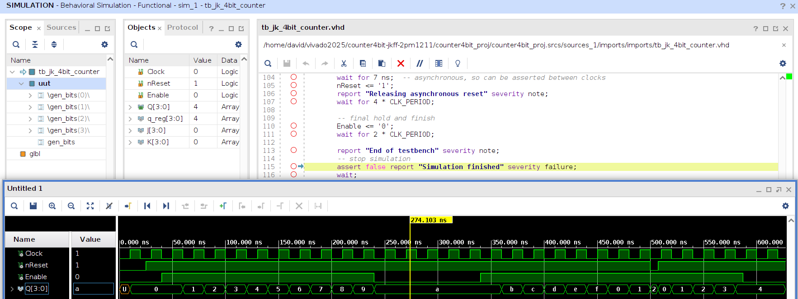

## FPGA Project: 4-bit Counter using JK Flip-Flops

##### Objectives: 
* To understand JK flip-flops and 2-stage synchronizer.
* To implement debounce to avoid switch bounce on `Basys 3`, a development board built around an AMD Artix-7 FPGA.

---

* **Basys 3**:  [Manual](https://digilent.com/reference/programmable-logic/basys-3/reference-manual) | [PDF](https://digilent.com/reference/_media/basys3:%20basys3_rm.pdf) | [JTAG-HS2](https://digilent.com/reference/_media/jtag_hs2:jtag-hs2_rm.pdf) | [Schematic](https://digilent.com/reference/_media/reference/programmable-logic/basys-3/basys-3_sch.pdf) | [Pinouts](https://www.nhn.ou.edu/~bumm/ELAB/Labs/Basys3_FGPA_pin_outs.pdf) | [XDC](https://digilent.com/reference/_media/basys3/basys3_master.zip)
* Vivado Version: `2025.2`.
* Simulator: `xsim` (Xilinx Simulator).

---

### How to run?

* Step 1. Configure your Vivado paths:
```
export XILINX_VIVADO=<path_to_dir>/Xilinx/2025.2/Vivado
export PATH=<path_to_dir>/Xilinx/2025.2/Vivado/bin:$PATH
```
Or, a better way to configure it by:
```
source <path_to_dir>/Xilinx/2025.2/Vivado/settings64.sh
```

* Step 2. Then, open the **Vivado** with
```
vivado
```

* Step 3. Click `Window` >> `Tcl Console` (shortcut: `Ctrl + Shift + T`), navigate to your Tcl Console, and type
```
source main.tcl
```

* Step 4. Click `Generate Bitstream`. You will finally get a bitstream file (*.bit).

* Step 5: Program your FPGA board and start your experiment. Here is my counter: [video](https://youtu.be/lHUYbL7JJKo).

---

### Simulation

* To start the simulation in Vivado (**xsim**), continue the following steps.

* Step 5: Select your alternative top source for your testbench.
  * Here, your top testbench ```tb_jk_4bit_counter``` is selected, so its corresponding top source is ```jk_4bit_counter.vhd```.

* Step 6: Click `Run Simulation` and then wait a minute until the waveform is presented. Right click on the wave window and select `Full View`.

