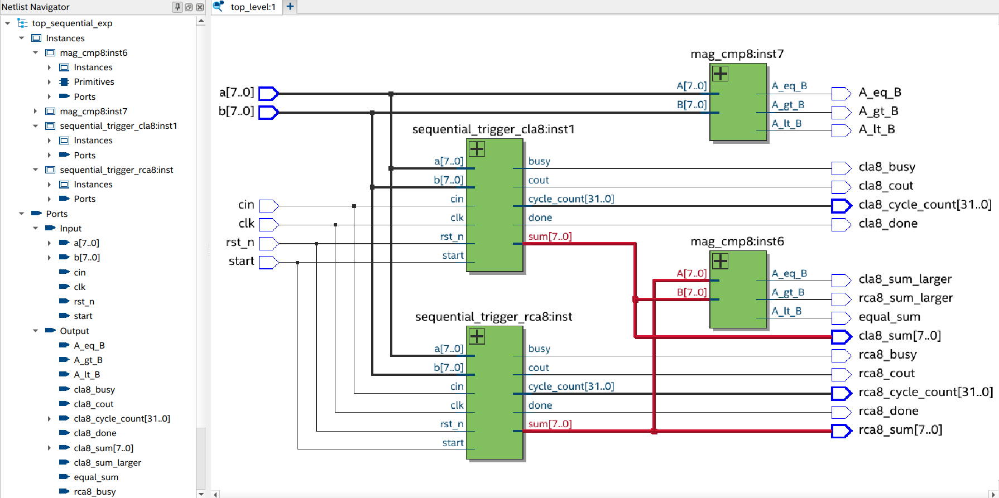
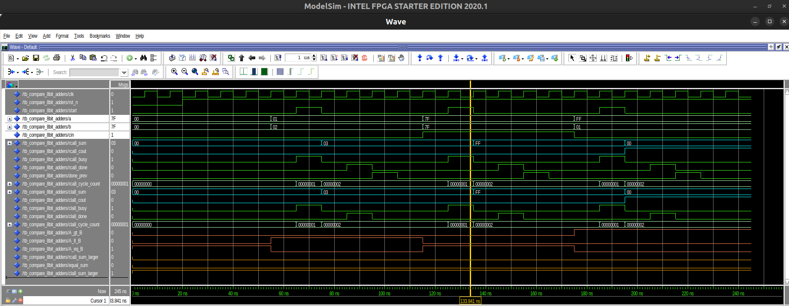
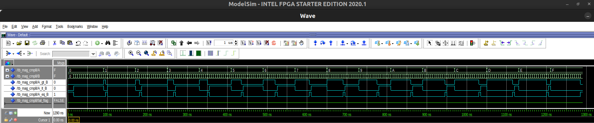

## Project 4: FSM-based Adders with Comparators

[Code](https://github.com/twwang97/altera-de2-115/tree/nycu2025/compare-8bit-adders/src) | [Report](https://github.com/twwang97/altera-de2-115/tree/nycu2025/4bit-adder/vsim/report.pdf)

##### Objectives: 
* To understand half adders, full adders, 8-bit **ripple-carry adder (RCA)**, **carry-lookahead adder (CLA)**, finite state machine (FSM), and **magnitude comparator**.
* To encode/decode the states in FSM and write a simple sequential wrapper that latches inputs on a start pulse for RCA and CLA.
* To design a block diagram including RCA/CLA and two **8-bit magnitude comparators** and write a testbench on **ModelSim**.

---

* Altera DE2-115: [User Manual](https://www.terasic.com.tw/attachment/archive/502/DE2_115_User_manual.pdf).
* Quartus Prime Version: `24.1std.0 Lite Edition`.
* ModelSim Version: `Starter 2020.1`.
* Netlist after compilation:



---

### How to run?

* Step 1. Find your Quartus license and export the file path:
```
export LM_LICENSE_FILE=/root/.altera.quartus/quartus2_lic.dat
```

* Step 2. Open the **Quartus Prime Lite** with
```
<path_to_dir>/intelFPGA_lite/24.1std/quartus/bin/quartus
```

* Step 3. Click `View` >> `Utility Windows` >> `Tcl Console`
* Step 4. Navigate to your Tcl Console and type
```
source main.tcl
```
* Step 5: Start Compilation (shortcut: `Ctrl + L`).
* Step 6: Start a simulation directly from the Quartus GUI by going to `Tools > Run Simulation > RTL Simulation`. ModelSim will automatically open, and your simulation signals will be presented.
* Step 7: Right click on the wave window and select `Zoom Full`.



---

##### Testbench Options

```
tb_compare_8bit_adders.vhd
tb_rca_8bit.vhd
tb_cla_8bit.vhd
tb_mag_cmp4.vhd
```
The default testbench is `tb_compare_8bit_adders`. To change it, you should:
* (1) change your top-level entity, and also
* (2) modify your NativeLink settings by going to `Assignments > Settings > EDA Tool Settings > Simulation > NativeLink settings`.
* For example, you can select the Verilog file `mag_cmp4.v` as your top-level entity; and also select the module `tb_mag_cmp4` as your testbench in your NativeLink settings. Then start compilation and your simulation can be observed as follows:



---

* Note-1. You can re-do the simulation in QuestaSim (ModelSim) by executing
```
do ./src/wave.do
```
Where `wave.do` was generated by clicking `File` >> `Save Format`.

* Note-2. **ModelSim** can be executed independetly without Quartus Prime by opening
```
<path_to_dir>/intelFPGA/20.1/modelsim_ase/bin/vsim
```
