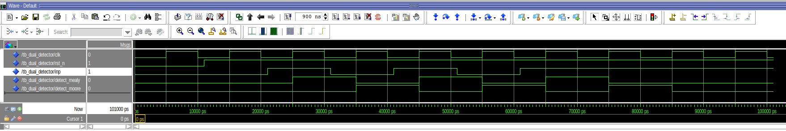

## Project 3: Mealy and Moore Finite State Machine (FSM)

* Objectives: 
  - To understand 1-, 2-, and 3-process FSM.
  - To compare Mealy machines with Moore ones.
  - To distinguish the combinational process (`always @(*)`) from the sequential process (`always @(posedge clk or negedge rst_n)`).
  - To follow the 2-process FSM style (combinational next-state/output logic + sequential state (and output) register) and simulate the Moore/Mealy FSMs with ModelSim.

* Altera DE2-115: [User Manual](https://www.terasic.com.tw/attachment/archive/502/DE2_115_User_manual.pdf).
* Quartus Prime Version: `24.1std.0 Lite Edition`.
* ModelSim Version: `Starter 2020.1`.

---

### How to run?

* Step 1. Find your Quartus license and export the file path:
```
export LM_LICENSE_FILE=/root/.altera.quartus/quartus2_lic.dat
```

* Step 2. Open the **Quartus Prime Lite** with
```
<path_to_dir>/intelFPGA_lite/24.1std/quartus/bin/quartus
```

* Step 3. Click `View` >> `Utility Windows` >> `Tcl Console`
* Step 4. Navigate to your Tcl Console and type
```
source main.tcl
```
* Step 5: Start Compilation (shortcut: `Ctrl + L`).
* Step 6: Start a simulation directly from the Quartus GUI by going to `Tools > Run Simulation > RTL Simulation`. ModelSim will automatically open, and your simulation signals will be presented.
* Step 7: Right click on the wave window and select `Zoom Full`.



---

##### Testbench Options

```
tb_dual_detector.vhd
tb_mealy.vhd
tb_moore.vhd
```
The default testbench is `tb_dual_detector`. To change it, you should:
* (1) change your top-level entity, and also
* (2) modify your NativeLink settings by going to `Assignments > Settings > EDA Tool Settings > Simulation > NativeLink settings`.
* For example, if you want to simply test the Mealy FSM, you can select the Verilog file `mealy_detect_01.v` as your top-level entity. Also remember to select the module `tb_mealy` as your testbench in your NativeLink settings. Next, start compilation and then your simulation will be shown.

---

* Note-1. You can re-do the simulation in QuestaSim (ModelSim) by executing
```
do ./vsim/wave.do
```
Where `wave.do` was generated by clicking `File` >> `Save Format`.

* Note-2. **ModelSim** can be executed independetly without Quartus Prime by opening
```
<path_to_dir>/intelFPGA/20.1/modelsim_ase/bin/vsim
```
